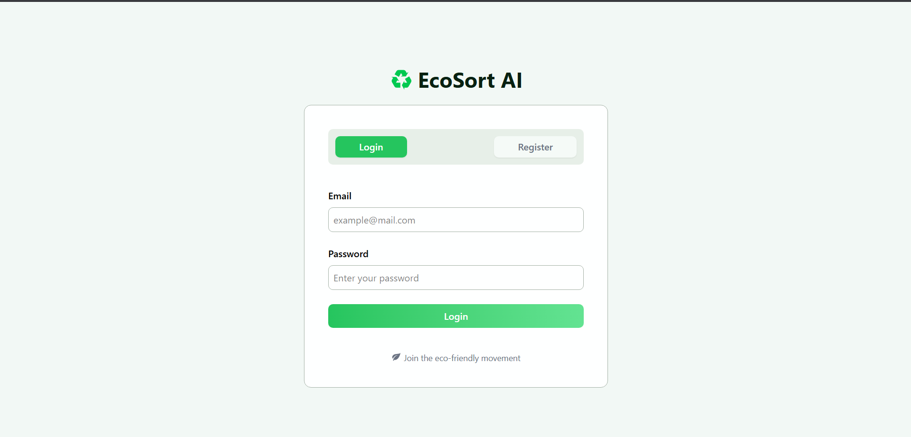
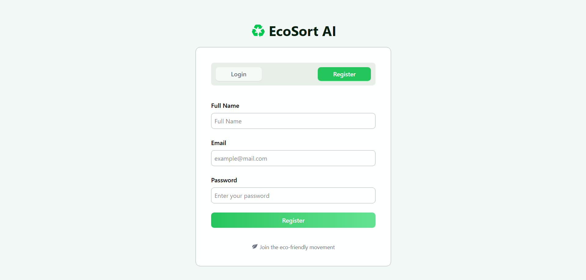
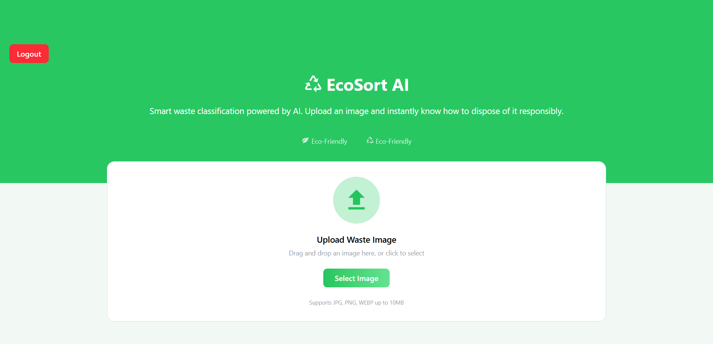
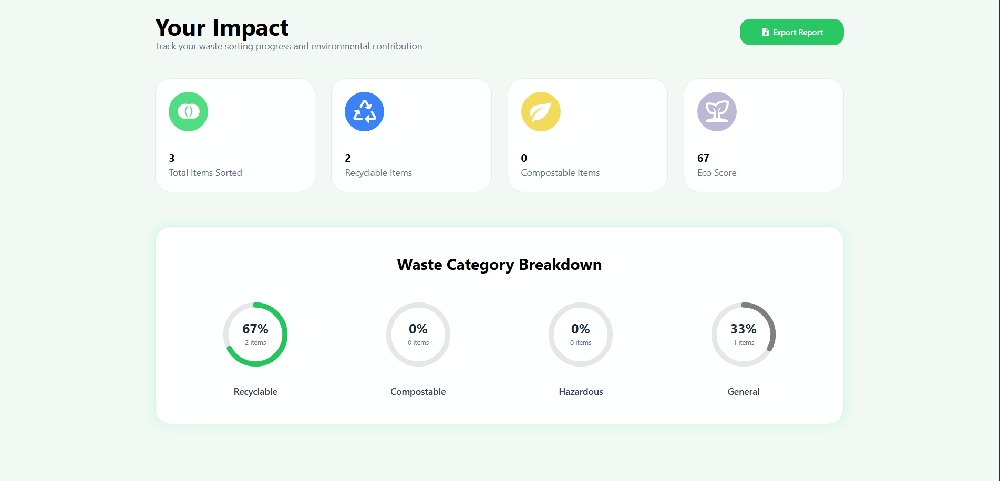
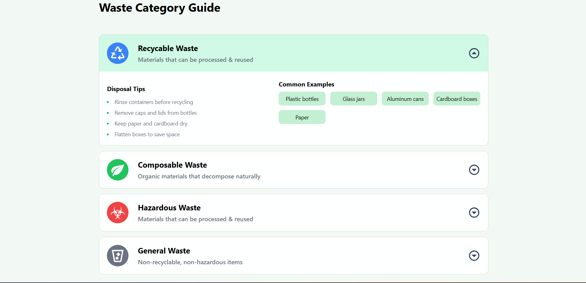
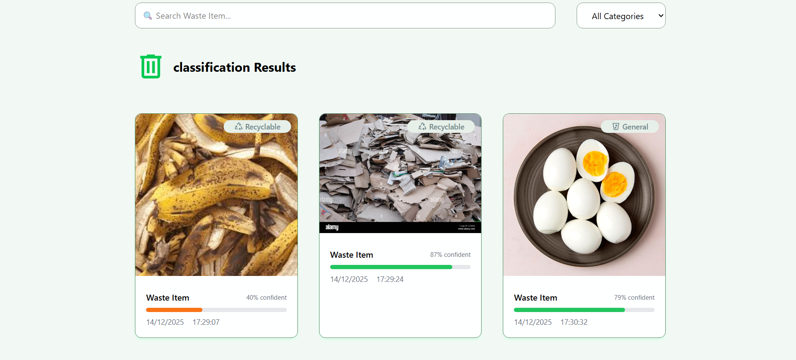

# ♻️ EcoSort AI

**EcoSort AI** is a smart, AI-powered waste classification platform that helps users dispose of waste responsibly. By simply uploading an image, users can instantly determine whether an item is **recyclable, compostable, hazardous, or general waste**, while tracking their environmental impact over time.

---

## Why EcoSort AI?

Incorrect waste sorting leads to:
- Increased landfill pollution  
- Contaminated recycling streams  
- Environmental and health hazards  

EcoSort AI solves this problem by making waste classification **simple, accurate, and accessible** using artificial intelligence.

---

## Key Features

### Authentication
- Secure **Login & Registration**
- User profile management

### AI Waste Classification
- Upload an image of waste
- AI classifies it into:
  - Recyclable
  - Compostable
  - Hazardous
  - General Waste
- Confidence score for each prediction

### Waste Category Guide
- Built-in **visual guide** explaining each waste category
- Helps users understand *why* an item belongs to a specific category
- Educates users without requiring environmental expertise

### User Impact Dashboard
- Total items sorted
- Category distribution
- Eco score based on responsible behavior
- Visual progress tracking

### Export Reports
- Download waste classification reports
- Track progress and environmental contribution

### Smart Search & Filters
- Search waste items by name
- Filter results by waste category

---

## AI Capabilities

- Image-based waste classification using **ML.NET**
- CNN-based image recognition model
- Confidence estimation for predictions
- Extensible architecture for future model improvements

---

## Screenshots

### Login Page

### Register Page

### Upload Waste Image

### Dashboard & Impact Tracking

### Waste Category Guide

### Classification Results

---

## Tech Stack

### Frontend
- **Vue.js**
- **TypeScript**
- **Tailwind CSS**

### Backend
- **.NET (ASP.NET Core Web API)**

### AI / Machine Learning
- **ML.NET**
- CNN-based image classification

### Database
- **PostgreSQL**

